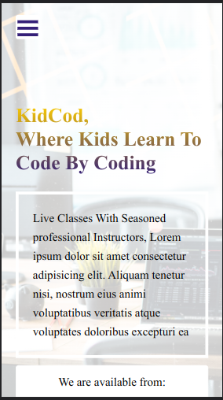

# Capstone-project-online-courses

Kids Learn To Code By Coding. Live Classes With Seasoned professional Instructors

## Built With

- Html and css, javascript

## Live Demo

[Live Demo Link](https://jenadiusnicholaus.github.io/capstone-project-online-courses/)

## watch the video

[How kidco works](https://www.loom.com/share/7f6de4e05ec04af980631927e6816e14)

## Prerequisites

- Html and css , javascripts

## Author

 Jenadius Nicholaus

- GitHub: *[@jenadiusnicholaus](https://github.com/jenadiusnicholaus/)*.

- Twiter: *[@jenadius_kaim](https://twitter.com/jenadius_kaim)*.

- LinkedIn: *[@Jenadius Nicholaus](https://www.linkedin.com/in/jenadius-nicholaus-73126819b/)*.

 Contributing

 Contributions, issues, and feature requests are welcome!

## Acknowledgments

- Hat tip to anyone whose code was used
- And an appropriate  goes to  Creative Commons for the best desin.  
- Inspiration
- etc